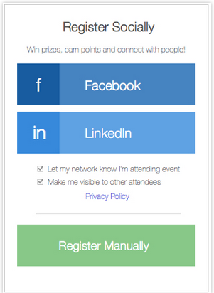
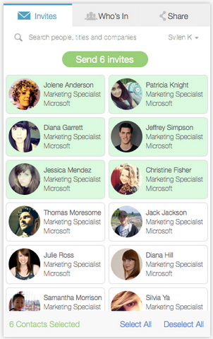

# InGo Widget Installation and Customization

----

## _Getting Started Guide for Registration Companies_

## InGo Widget Overview

InGo empowers attendees to be Advocates for your event who create larger, more social,
and more valuable events through a series of organizer customized widgets that include:

- Login Widget to accelerate registration and spread excitement about the event; the first opportunity for leaders to be empowered.
- Registration Widget to autofill information based on the users social network.
- Confirmation Widget to confirm an attendee has completed registration and post to his network.
- Social Widget to encourage more adoption by allowing leaders to see who is attending, or encouraging leaders to invite their key contacts.

## Types of Widgets

### Login Widget

The Login Widget is where most registrants become InGo Users, so installing this widget is
critical to a successful InGo implementation. Installing Login allows registrants to see InGo’s
`suggested invitees` on the Social Widget immediately upon reaching the confirmation page,
increasing the number of invites sent.



### Registration Widget

The Registration Widget executes auto-completion or auto-fill. It auto-fills parameters pulled through from
the Login Widget, including: `First Name, Last Name, Email, Company, and Title`. The Registration Widget
is installed on each page where autofill is desired.

This widget helps speed up the registration process for attendees giving them a more enjoyable registration experience.


### Social Widget

The Social Widget houses two tabs; the `Who’s In` tab and the `Invite` tab. `Who’s In` provides a
visualization of who is attending your event. The Invites tab gives registrants the opportunity
to invite their social connections to the event.



Per InGo Best Practices, the Social Widget should be installed `above the fold` on the confirmation page
so registrants are more inclined to invite their InGo-suggested friends to your event. Installing `above the fold`
translates to higher adoption rates, pending any other major call-to-action items that may distract from
the registration call-to-action. The InGo Social Widget shoudl be the singular call to action with no other social network buttons to distract the user.


### Confirmation Widget

The Confirmation Widget is used to confirm when a registrant has completed the registration process.
It collects the following parameters from all registrants (social and manual) to ensure that the
Registrant has completed registration.

* First name
* Last name
* Email
* Company
* Title

This widget is also responsible for sending posts that go on the registrants social media newsfeed, announcing their attendance. This function is only completed provided the registrants leave the option selected or check box confirmed to "Let my network know I am attending the event." Any registrant who opts out of this process does `not` post to his or her network(s).

---


## Recommended Installation for an event Web site

1. Confirmation Page (final registration page)
  1. Confirmation Widget
  2. Social Widget with Invitation tab as default
1. Registration Pages
  1. Registration Widget to autocomplete data
1. Event Home Page
  1. Login Widget
  2. Social Widget with Who’s In as default

When creating widgets on this site, all widget IDs will be provided in the instructions sent to the Developer/Marketing Manager or Event Point of Contact who is actually installing the code. IDs are unique and valid only during the event lifetime.

### Using `<script>` tags (most common and prefered way for all widgets)

For Login Widget and Social Widget need to insert `<script>` tag inside of webpage in place where widget should appear. For Registration Widget need to insert `<script>` tag after registration form(s). For Confirmation Widget `<script>` tag can be inserted at any place, but inserting it earlier on page prefered (e.g. to the bottom of `<head>` tag).

Simple example of `<script>` (for more instructions read further):

```html
<script
   async
   src="//cdn.ingo.me/widgets-loader/latest/js/ingo.loader.widget.js"
   data-ingo-id="WIDGET_ID_HERE"></script>
```

All next methods is not recommended for general usage, but should be used on some exceptional cases described in each method.

### Call widget code directly (for registration, social, login widgets)

This method should be used if you need some specific behaviour to call widgets. For example you create part of page with other scripts.

Insert somewhere on top of page `<script>` tag without `data-ingo-id` attribute. When you know that part of page already exists in page, call widget code in such way (for widget specific instructions read further):

```js
//for registration widget
InGo.ingoWidget({ widgetId: 'WIDGET_ID_HERE' });

//for social widget and login widget
InGo.$('selector').ingoWidget({ widgetId: 'WIDGET_ID_HERE' });
```

### Use `<iframe>` (for social, login widgets)

If your site has incompatible with InGo Widgets scipts. Most frequent example is prototype.js.

To use this method insert in place where widget should appear `<iframe src="//ingo.me/widgets/iframe?widget_unique_id=WIDGET_ID_HERE"></iframe>`. It is possible also will need to change default style for iframe.

---
## Widget Specific Details

You can copy any code snippet for usage.

### Login Widget

The `data-ingo-target` attribute of `<script>` tag may be specified with the CSS selector of a element for which widget will be applied.

How to install this widget on a Web page:

 - **Embedded `<script>` by widget ID**

   Place the `<script>` with the widget ID where it must appear on the page, usually inside some `<div>` element:

   ```html
   <script
      async
      src="//cdn.ingo.me/widgets-loader/latest/js/ingo.loader.widget.js"
      data-ingo-id="[INGO-WIDGET-ID]"></script>
   ```

 - **Served as a pop-up overlay when a `Register` button is clicked.**

   Pop-Up (Modal) Overlay Example, place it where the button must appear on the page:

   ```html
   <script
      async
      src="//cdn.ingo.me/widgets-loader/latest/js/ingo.loader.widget.js"
      data-ingo-id="[INGO-WIDGET-ID]" data-ingo-button="Register Now!"></script>
   ```

 - **Served as pop-up overlay or embedded for specific target element**

   If page already contain container element or button which should be used to trigger the login widget modal. Need to specify this element CSS selector in `data-ingo-target` attribute:

   ```html
   <script
      async
      src="//cdn.ingo.me/widgets-loader/latest/js/ingo.loader.widget.js"
      data-ingo-id="[INGO-WIDGET-ID]" data-ingo-target="CSS SELECTOR HERE"></script>
   ```

 - **Executed directly via javascript code for pop-up overlay**

   Add to the bottom of page such snippet:

   ```html
   <script src="//cdn.ingo.me/widgets-loader/latest/js/ingo.loader.widget.js"></script>
   ```

   Assume in page exists `<button id="button">Register</button>` and need to make widget pop-up appearing on click:

   ```html
   <script>
      InGo.$('#button').ingoWidget({ widgetId: 'WIDGET_ID_HERE' });
   </script>
   ```

 - **Executed directly via javascript code for in page block**

   Add to the bottom of page such snippet:

   ```html
   <script src="//cdn.ingo.me/widgets-loader/latest/js/ingo.loader.widget.js"></script>
   ```

   Assume in page exists `<div id="login-form"></div>` and need to make widget appearing inside of this element:

   ```html
   <script>
      InGo.$('#login-form').ingoWidget({ widgetId: 'WIDGET_ID_HERE' });
   </script>
   ```

 - **`<iframe>` case as in page block**

   Insert in place where widget should appear such snippet:

   ```html
   <iframe src="//ingo.me/widgets/iframe?widget_unique_id=WIDGET_ID_HERE"></iframe>
   ```

   Also you will need to edit `style` attribute to make iframe appearing correct for specific set of settings and situations.

----

### Registration Widget

For example page has these forms and fields:

    <form id="registration-form">
       <input …>
    </form>

 - **Embedded `<script>` with widget ID (prefered way)**

   Code to insert in the somewhere **after** this form:

   ```html
   <script
      async
      src="//cdn.ingo.me/widgets-loader/latest/js/ingo.loader.widget.js"
      data-ingo-id="[INGO-WIDGET-ID]"></script>
   ```
 - **Directly executed code with widget ID**

   Add to the bottom of page such snippet:

   ```html
   <script src="//cdn.ingo.me/widgets-loader/latest/js/ingo.loader.widget.js"></script>
   ```

   After form appeared on page, need to execute such code:

   ```html
   <script>
   InGo.ingoWidget({ widgetId: '[INGO-WIDGET-ID]' });
   </script>
   ```

----

### Social Widget

 * Social Widget State 1: `Who’s In`
   *  The whosin tab lets users see who already registered for event
 * Social Widget State 2: `Invites`
   * The invites tab lets users invite their friends (imported from authorized social networks.)
 * Social Widget State 3: `Share`
   * The share tab allows users share their event experience using social services`

 - ** Embedded mode with widget ID (prefered way)**

   Place the `<script>` with the widget ID where it must appear on the page,
   usually inside some `<div>` element:

   ```html
   <script
      async
      src="//cdn.ingo.me/widgets-loader/latest/js/ingo.loader.widget.js"
      data-ingo-id="[INGO-WIDGET-ID]"></script>
   ```

 - ** Embedded mode with widget ID, when container not exists on page load**

   Add to the bottom of page such snippet:

   ```html
   <script src="//cdn.ingo.me/widgets-loader/latest/js/ingo.loader.widget.js"></script>
   ```

   After container created you need to execute such code:

   ```js
   InGo.$('constainer selector here').ingoWidget({ widgetId: '[INGO-WIDGET-ID]' });
   ```

 - ** Embedded via `<iframe>`**

   Need to insert code snippet:

   ```html
   <iframe src="//ingo.me/widgets/iframe?widget_unique_id=[INGO-WIDGET-ID]"></iframe>
   ```

   Also you will need to edit `style` attribute to make iframe appearing correct for specific set of settings and situations.
----

### Confirmation Widget

There are two ways to invoke this widget:

 - **Method One:** Every user that hits this page will have gone through the Login Widget first -
    (the login widget must include manual fields or it must be impossible to register without a social account)

    ```html
      <script
        src="//cdn.ingo.me/widgets-loader/latest/js/ingo.loader.widget.js"
        data-ingo-id="[INGO-WIDGET-ID]"></script>
    ```

 - **Method Two**: Providing data to the widget for manual attendees via the attendee parameter for cases when the attendee name
      is resolved dynamically from a form or session, in this case we submit it via Javascript.

  ```html
   <script
    src="//cdn.ingo.me/widgets-loader/latest/js/ingo.loader.widget.js"></script>
   <script>
     window.InGo.ingoWidget({
       widgetId: "[INGO-WIDGET-ID]",
       attendee: {
         email: "##User’s email here##",
         firstName: "##User’s first name here##",
         lastName: "##User’s last name here##",
         company: "##User’s company here##",
         title: "##User’s job title here##"
     }});
   </script>
  ```

 - **Method Three:** Providing data to the widget for manual attendees with predefined attendee name or when the script
      tag below is autogenerated as a while with attendee name set as the attributes.

    ```html
       <script
         src="//cdn.ingo.me/widgets-loader/latest/js/ingo.loader.widget.js"
         data-ingo-id="[INGO-WIDGET-ID]"
         data-ingo-attendee.email="##User’s email here##"
         data-ingo-attendee.first-name="##User’s first name here##"
         data-ingo-attendee.last-name="##User’s last name here##"
         data-ingo-attendee.company="##User’s company here##"
         data-ingo-attendee.title="##User’s job title here##"></script>

    ```

    Note that attributes must be correctly encoded.

 - **Method Four:** Assumed that was used login widget with manual field enabled.
    Registration site does not allow to use `<script>` tags. In this case need to use such snippet:

    ```html
    </img>
    ```

 - **ADDITIONAL ATTENDEES:** If the attendee registered additional attendees, you must add one extra call for each additional attendee with the parameter additional = true. It works only with method 2 and 3:

  - Method Two: 

  ```html
   <script
    src="//cdn.ingo.me/widgets-loader/latest/js/ingo.loader.widget.js"></script>
   <script>
     window.InGo.ingoWidget({
       widgetId: "[INGO-WIDGET-ID]",
       attendee: {
         additional: true,
         email: "##User’s email here##",
         firstName: "##User’s first name here##",
         lastName: "##User’s last name here##",
         company: "##User’s company here##",
         title: "##User’s job title here##"
     }});
   </script>
  ```

  - Method Three:

    ```html
       <script
         src="//cdn.ingo.me/widgets-loader/latest/js/ingo.loader.widget.js"
         data-ingo-id="[INGO-WIDGET-ID]"
         data-ingo-attendee.additional="true"
         data-ingo-attendee.email="##User’s email here##"
         data-ingo-attendee.first-name="##User’s first name here##"
         data-ingo-attendee.last-name="##User’s last name here##"
         data-ingo-attendee.company="##User’s company here##"
         data-ingo-attendee.title="##User’s job title here##"></script>

    ```

----

InGo, Inc.  |  www.ingo.me  |  Try InGo -  www.demo.ingo.me  |  2500 Wilson Blvd. #215, Arlington VA 22201
